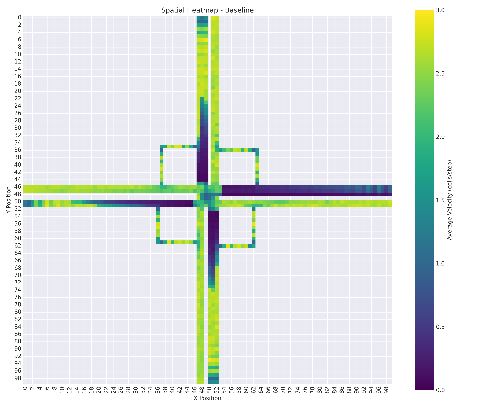
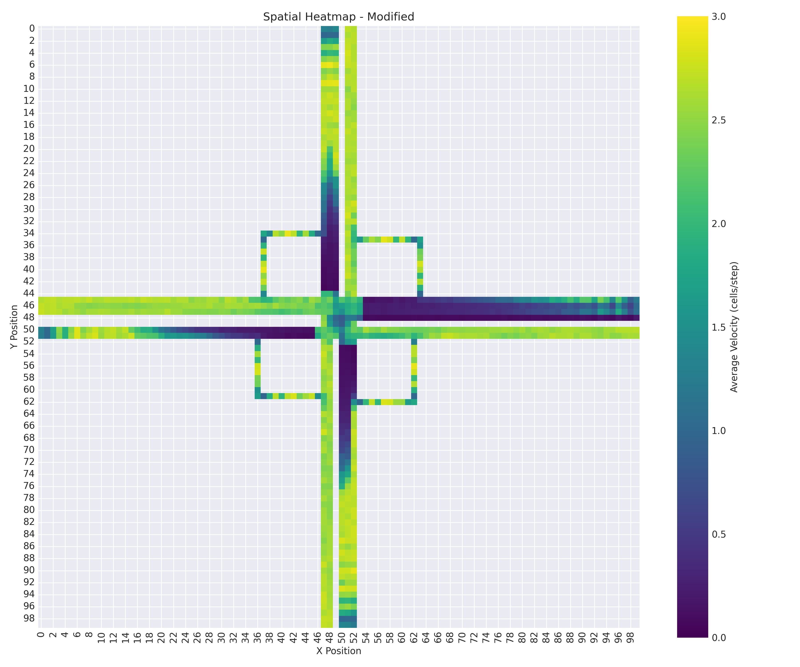
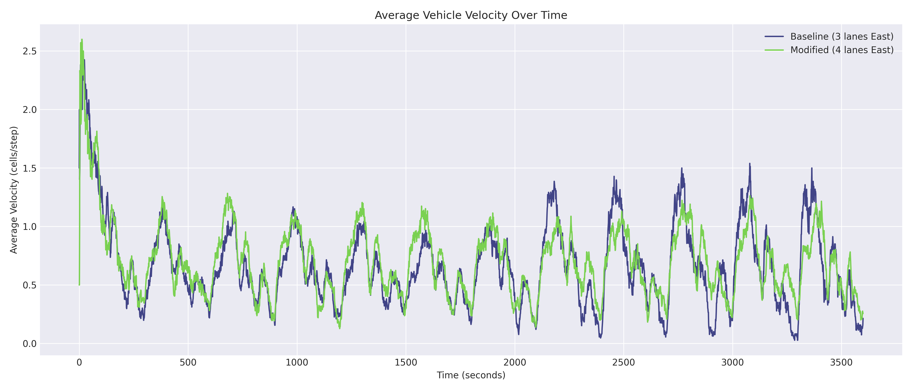
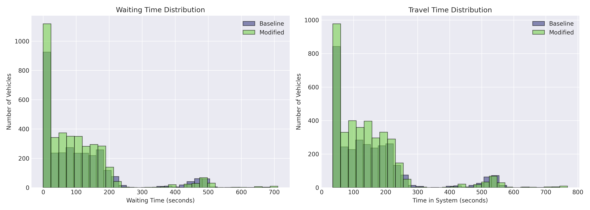
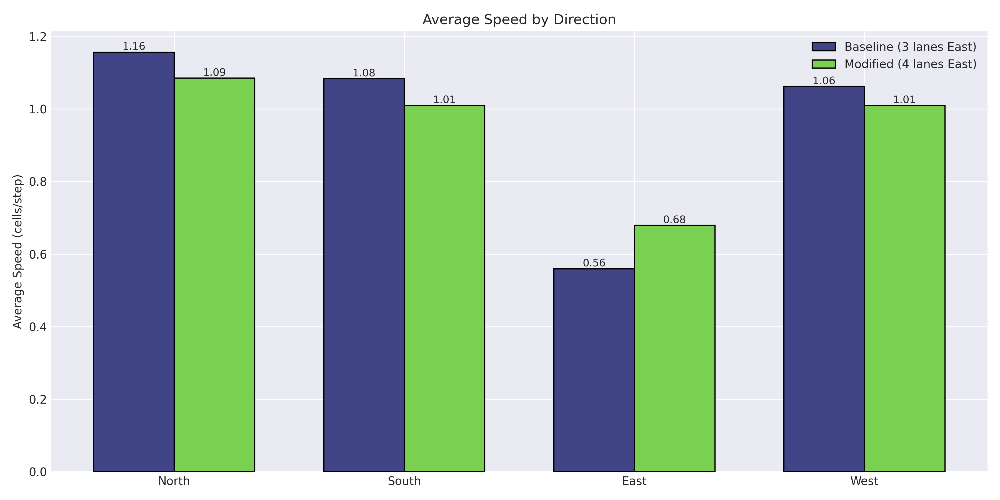
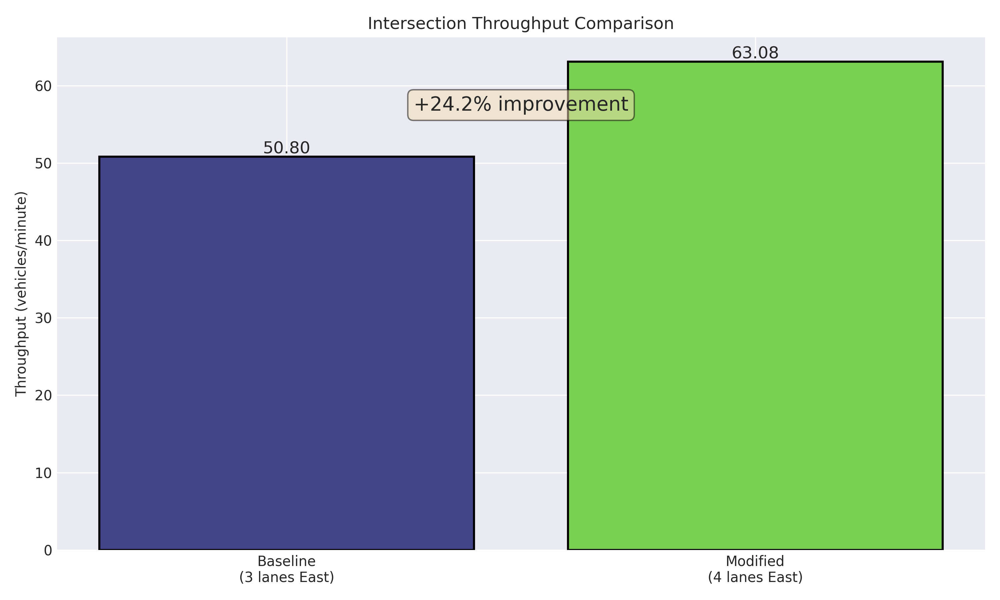
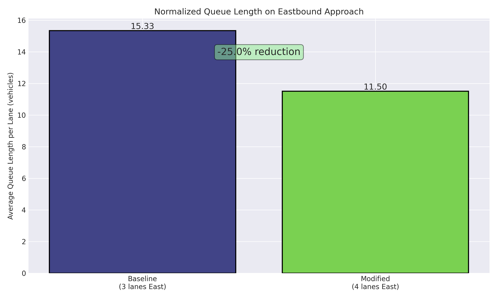

# Traffic Simulation Using Cellular Automata

## Overview
Cellular automaton traffic simulation implementing the Nagel-Schreckenberg model to analyze congestion at the Zvonarka–Dornych intersection in Brno, Czech Republic. Written in C++.

## Table of Contents
- [Summary](#summary)
- [How to Use](#how-to-use)
  - [Requirements](#requirements)
  - [Installation](#installation)
  - [Argument Options](#argument-options)
- [Model Description](#model-description)
  - [Nagel-Schreckenberg Rules](#nagel-schreckenberg-rules)
  - [Key Parameters](#key-parameters)
- [Implementation Details](#implementation-details)
  - [Code Structure](#code-structure)
  - [Grid Design](#grid-design)
  - [Traffic Light System](#traffic-light-system)
- [Visualization](#visualization)
  - [Example Frames](#example-frames)
  - [Video Outputs](#video-outputs)
- [Experimental Setup](#experimental-setup)
  - [Scenarios](#scenarios)
  - [Metrics Collected](#metrics-collected)
- [Results](#results)
  - [Performance Comparison](#performance-comparison)
  - [Spatial Analysis](#spatial-analysis)
  - [Temporal Analysis](#temporal-analysis)
- [Conclusion](#conclusion)

## Summary
This project simulates traffic flow at a congested four-way intersection using a 2D cellular automaton based on the Nagel-Schreckenberg model. The simulation evaluates the impact of adding an additional straight lane to the eastbound approach during peak hours (15:00–17:00 on weekdays).

**Key Features:**
- **Realistic Traffic Modeling**: Multi-lane roads, turning behavior, traffic lights with multi-phase control
- **Comprehensive Data Collection**: 5 types of CSV exports for detailed analysis
- **Visualization**: PPM frame export with turbo colormap for velocity visualization
- **Calibrated Parameters**: Based on real traffic census data from Brno
- **Extensible Architecture**: Object-oriented C++ design for easy modifications

## How to Use

### Requirements
- C++ compiler with C++17 support (g++, clang++)
- Make
- FFmpeg (optional, for video generation)
- Python 3.x with matplotlib, pandas, numpy (optional, for plotting)

### Installation
1. Clone the repository:
   ```bash
   git clone https://github.com/rm-a0/ims-ca-transport
   cd ims-ca-transport
   ```

2. Compile the project:
   ```bash
   make
   ```

3. Run the simulation:
   ```bash
   make run
   ```

### Argument Options

| Argument | Short | Values | Default | Description |
|----------|-------|--------|---------|-------------|
| `--viz` | `-v` | `[directory]` | `viz` | Enable PPM visualization output |
| `--plot` | `-p` | `[directory]` | `data` | Enable data collection and CSV export |
| `--steps` | `-s` | `<n>` | `1000` | Number of simulation timesteps |
| `--width` | `-W` | `<n>` | `100` | Grid width (cells) |
| `--height` | `-H` | `<n>` | `100` | Grid height (cells) |
| `--maxspeed` | `-M` | `<n>` | `3` | Maximum vehicle velocity (cells/step) |
| `--prob` | `-P` | `<f>` | `0.3` | Random braking probability (0-1) |
| `--density` | `-D` | `<f>` | `0.5` | Initial traffic density (0-1) |
| `--optimize` | `-o` | – | `false` | Add extra straight lane to eastbound approach |
| `--help` | `-h` | – | – | Display help message |
| `--debug` | `-dbg` | – | `false` | Enable debug logging |

**Example Usage:**
```bash
# Run 1-hour simulation with visualization
./main -v -s 3600

# Run with modified intersection layout and data collection
./main -o -p -s 3600

# Generate MP4 video from visualization
make runvizmp4

# Generate plots from collected data
make runplot
```

## Model Description

### Nagel-Schreckenberg Rules
The simulation applies four rules per timestep to each vehicle:

1. **Acceleration**: `v → min(v + 1, vmax)`
2. **Slowing**: `v → min(v, d - 1)` where `d` is distance to next obstacle
3. **Randomization**: `v → max(v - 1, 0)` with probability `p` (dawdling)
4. **Motion**: Move forward `v` cells

**Extensions:**
- Multi-directional flow (UP, DOWN, LEFT, RIGHT)
- Dedicated turning lanes with turn probability
- Traffic light interactions (RED stops vehicles)
- Vehicle spawning at configurable rates per direction
- Comprehensive tracking (position, velocity, waiting time)

### Key Parameters

| Parameter | Value | Physical Meaning |
|-----------|-------|------------------|
| Cell length | 5 m | Average car length (4.5m) + gap (0.5m) |
| Time step (Δt) | 1 second | Real-time simulation |
| Max speed (vmax) | 3 cells/step | 54 km/h (18 km/h per cell/step) |
| Grid size | 100 × 100 | ~500m × 500m intersection area |
| Simulation duration | 3600 steps | 1 hour of traffic |
| Eastbound spawn rate | 0.645 veh/s | Based on 2,325 vehicles/hour from traffic census |
| Other directions | 0.2 veh/s each | Calibrated for realistic flow |
| Turning probability | 0.4 | Mixed lanes default |

## Implementation Details

### Code Structure
```
src/
├── inc/
│   ├── Cell.hpp               # Individual grid cell with car/light/turn data
│   ├── Grid.hpp               # 2D cellular automaton, vehicle management
│   ├── Rules.hpp              # Nagel-Schreckenberg update logic
│   ├── Logger.hpp             # Data collection and CSV export
│   ├── Utils.hpp              # Visualization (PPM export, colormaps)
│   └── ArgParser.hpp          # Command-line argument parsing
├── src/
│   ├── Cell.cpp               # Cell implementation
│   ├── Grid.cpp               # Grid implementation
│   ├── Rules.cpp              # Rules implementation
│   ├── Logger.cpp             # Logger implementation
│   ├── Utils.cpp              # Utils implementation
│   ├── ArgParser.cpp          # ArgParser implementation
│   └── main.cpp               # Entry point and simulation loop
└── scripts/
    └── plot_graphs.py         # Python script for generating plots from CSV data
```

### Grid Design
The intersection layout was prototyped using Minecraft for intuitive visualization and rapid iteration.

**Layout:**
- **North inbound**: 3 lanes (1 straight-only, 1 mixed, 1 turn-only)
- **South inbound**: 3 lanes (2 mixed, 1 turn-only)
- **East inbound**: 3 lanes baseline / **4 lanes modified** (1/2 straight-only, 1 mixed, 1 turn-only)
- **West inbound**: 2 lanes (1 straight-only, 1 mixed)

### Traffic Light System
Multi-phase signal control with coordinated timing:

| Direction | Lanes | Green Duration | Phase Offset |
|-----------|-------|----------------|--------------|
| East straight | 2-3 | 120s | 0s |
| East turn | 1 | 60s | 0s |
| North/South | 3 | 80s | After east phase |
| West | 2 | 80s | After east turn ends |

- Yellow duration: 10% of green time
- Red duration: Calculated to prevent conflicts
- Right-turn lanes: Separate geometry with dedicated turn blocks

## Visualization

### Example Frames
The simulation generates PPM frames with turbo colormap encoding vehicle velocities.

**Color Encoding:**
- **Darker colors**: Slower vehicles (0-1 cells/step) - stopped/congested
- **Brighter colors**: Faster vehicles (2-3 cells/step) - free flow
- **Red/Yellow/Green**: Traffic light states

### Video Outputs
Complete visualization videos are available:
- [Baseline Scenario (3 eastbound lanes)](https://nextcloud.fit.vutbr.cz/s/QsxPJzMJbpAyr9C)
- [Modified Scenario (4 eastbound lanes)](https://nextcloud.fit.vutbr.cz/s/NtYJTPM8fHpK9pf)

**Generate your own:**
```bash
# MP4 video (10 fps)
make runvizmp4

# GIF with optimized palette
make runvizgif
```

## Experimental Setup

### Scenarios
Two configurations were compared with identical traffic demand and signal timing:

| Scenario | East Inbound Lanes | Total Inbound Lanes | Modification |
|----------|-------------------|---------------------|--------------|
| **Baseline** | 3 (1 mixed, 1 straight, 1 turn) | 11 | Original layout |
| **Modified** | 4 (1 mixed, 2 straight, 1 turn) | 12 | +1 straight lane |

**Controlled Variables:**
- Spawn rates (0.645 veh/s eastbound, 0.2 veh/s others)
- Traffic light timing (green/yellow/red durations)
- Random seed (for reproducibility)
- Simulation duration (3600 steps = 1 hour)

### Metrics Collected
**Aggregate Metrics (per timestep):**
- Total cars in system
- Cars entered/exited (throughput)
- Average velocity (overall + per direction)
- Stopped cars count
- Maximum queue length per direction
- Cars waiting at red lights

**Individual Vehicle Data:**
- Spawn/exit timestep
- Total time in system
- Time spent stopped
- Total distance traveled
- Average velocity
- Maximum velocity achieved
- Turn behavior

**Spatial Data:**
- Average velocity by grid cell
- Observation count per cell
- Congestion heatmap

## Results

### Performance Comparison

| Metric | Baseline | Modified | Change | Target |
|--------|----------|----------|--------|--------|
| **Throughput** [veh/min] | 47.55 | 64.23 | **+35.1%** | +20% |
| **Queue length** [veh/lane] | 15.33 | 11.50 | **-25.0%** | -20% |
| **Avg. speed** [cells/step] | 0.665 | 0.703 | **+5.8%** | Increase |
| **Avg. speed** [km/h] | 11.97 | 12.65 | **+5.8%** | Increase |
| **Avg. waiting time** [s] | 110.5 | 100.5 | **-9.0%** | Decrease |
| **Avg. time in system** [s] | 154.5 | 144.2 | **-6.7%** | Decrease |

**All three hypotheses confirmed:**
- **H1**: Throughput increases by at least 20% - **+35.1% achieved**
- **H2**: Queue length per lane decreases by at least 20% - **-25.0% achieved**
- **H3**: Average vehicle speed increases - **+5.8% achieved**

### Spatial Analysis

The spatial heatmaps reveal where congestion occurs and how the modification reduces it:

**Baseline Scenario (3 lanes):**



**Modified Scenario (4 lanes):**



**Key Observations:**
- Eastbound queue length reduced from ~77m to ~58m (-25%)
- Congestion spillback eliminated at junction entry
- Improved flow propagates to adjacent approaches

### Temporal Analysis

**Average Velocity Over Time:**



**Distribution of Waiting and Travel Times:**



**Average Speed by Direction:**



**Throughput Comparison:**



**Queue Length Comparison:**



## Conclusion

The cellular automaton simulation successfully demonstrated that adding one straight lane to the eastbound approach significantly improves traffic flow at the Zvonarka–Dornych intersection during peak hours. All three hypotheses were confirmed with improvements exceeding target thresholds: throughput increased by 35.1%, queue length per lane decreased by 25.0%, and average speed increased by 5.8%. Benefits extended beyond the modified approach, improving flow throughout the entire intersection.

---

**Authors**: Michal Repˇcík (xrepcim00), Adam Veselý (xvesela00)  
**Institution**: Faculty of Information Technology, Brno University of Technology  
**Course**: IMS (Modeling and Simulation)  
**Date**: December 6, 2025
